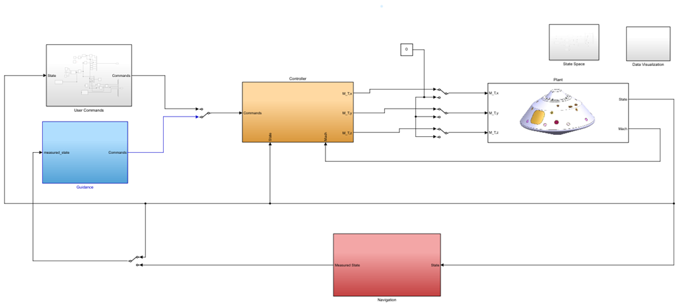

# 🚿 Guidance, Navigation and Control System for a Planetary Entry Vehicle

This project focuses on the simulation and design of a Guidance, Navigation, and Control (GNC) system tailored for atmospheric reentry vehicles targeting Mars missions. The project is inspired by classical and modern approaches to entry guidance, particularly leveraging Apollo-derived guidance schemes and enhancements developed for the Mars Science Laboratory (MSL) and Mars 2020 missions.
This projet was developed under the course Guidance Navigation and Control from Instituto Superior Técnico.

## 🔧 Features

- Simulink Reentry Simulation with CG offset dynamics
- Dead reckoning
- Apollo Guidance Law
- LQR with Integrative Augmentation Controller

📄 [Download Full Report (PDF)]()

## 📂 Project Structure

```
.
├── Aditional_DataSets/       # Supplemental data used in simulations or verification
├── Controller/               # Control system logic (attitude, bank angle, thrust control)
├── Guidance/                 # Entry guidance laws (e.g., Apollo-derived, MSL-style)
├── MonteCarlo_Sims/          # Monte Carlo runs for sensitivity and robustness analysis
├── Notes/                    # Design notes, references, or experimental logs
├── Simulador/                # Simulink blocks and simulation architecture
├── slprj/                    # Simulink auto-generated project folder (do not edit manually)
├── entryVehicle.slxc         # Compiled Simulink model of the entry vehicle
├── prepare_sim.m             # MATLAB script to set up simulation (initial conditions, config)
├── MSLEntryVehicle.jpg       # Reference image or schematic of the entry capsule
├── README.md                 # Project documentation
├── .gitattributes            # Git configuration file (handles line endings, etc.)
```

## ▶️ How to Run

```
Run prepare_sim.m to set up the simulation (initial conditions, condig, guidance and controller gains)...The nominal trajectory is described in the report.
```

### Dependencies:

- Matlab & Simulink

## 📸 Visual Overview





## 👨‍💻 Authors

Rafael Azeiteiro  [@rafacoimbratec]  

Alexandre Pereira [@alexpe12003] 

Eduadro Helena [@Dudax12123]

Guilherme Martins [@github]

Rodrigo Pereira [@rodmpereira14]

---

📘 Literature:

Inspired by:
Brugarolas, P. (2017). *Guidance, Navigation and Control for the Entry, Descent, and Landing of the Mars 2020 Mission*. AAS 17-031 (CL17-0498).


Main Controll Literature
Mooij, E. (2024). *Re-entry Systems* [Lecture Notes].

Main Navigation Literature
Crain, T. P., & Bishop, R. H. (2002). *Mars Entry Navigation: Atmospheric Interface Through Parachute Deploy*. AIAA 2002-4501.

Main Guidance Literature
Ives, D., Carman, G., & Geller, D. (1998). *Apollo-Derived Mars Precision Lander Guidance*. AIAA 98-4570.
Mendeck, G. F., & Craig, L. E. (2011). *Entry Guidance for the 2011 Mars Science Laboratory Mission*. NASA TM-20110013204.

 
